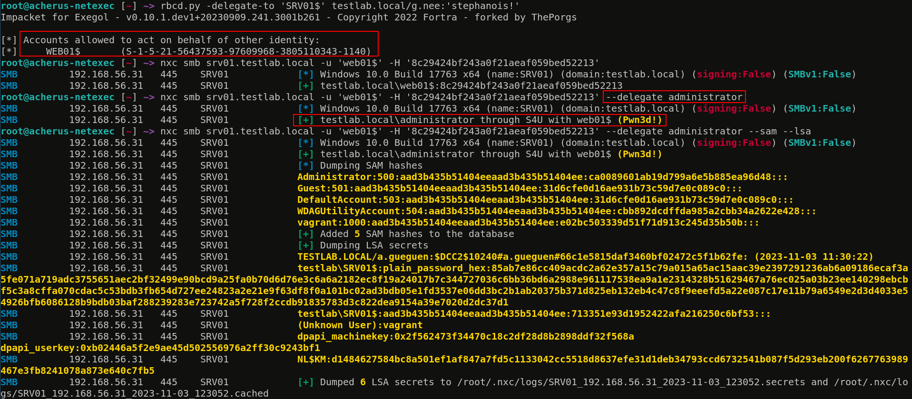
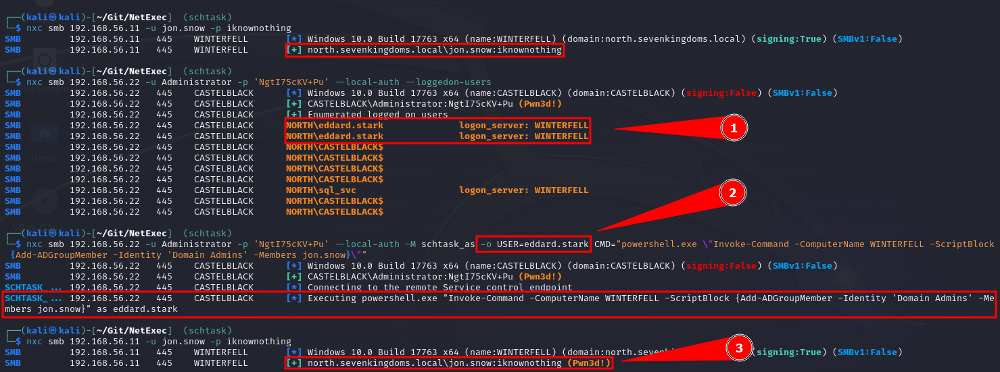
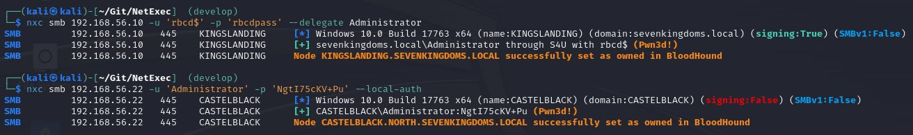
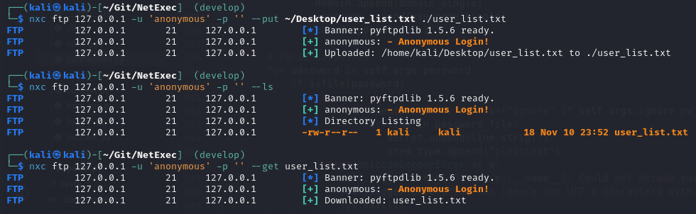
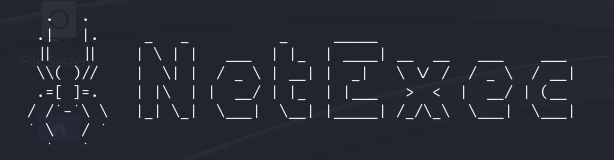

# 🔧 v1.1.0 - nxc4u



NetExec 发布了新版本！

在这篇博文中,我们将概述当前版本的新功能以及过去几周我们一直在开发的内容。Linux、Windows 和 MacOS 的原生二进制文件可在 GitHub 上获取。不过后者尚未经过测试,所以如果你在使用这些二进制文件时遇到任何问题,请告诉我们。

在过去的一个月里,我们收到并解决了大量的 pull request 和 issue。我们真的要感谢大家对 NetExec 的积极参与。不仅是 pull request,提交 issue 的人也非常重要。指出还存在哪些 bug 以及哪些功能可以让 nxc 变得更好真的很重要！

<figure><figcaption></figcaption></figure>

有很多很酷的 PR,让我们来看看:

### 听说过 Kerberos 委派吗？

添加了一个新的核心功能,由 [@zblurx](https://twitter.com/_zblurx) 开发,可以自动化 Kerberos 扩展 S4U2Self 和 S4U2Proxy。它允许你在 NetExec 中自动滥用带有协议转换的 Kerberos 约束委派和基于资源的约束委派。

<figure><figcaption></figcaption></figure>

你也可以只使用 S4U2Self 来模拟域加入计算机上任何已知凭据的账户:

<figure><figcaption></figcaption></figure>

### 使用计划任务代表已登录用户执行任务

寻找不应该登录到系统的用户 🏹 感谢 [@Defte_](https://twitter.com/Defte_) 的新模块 "schtask_as",使用用户会话执行命令现在比以往任何时候都更容易。这允许你使用 Windows 任务调度机制来模拟已登录用户。

<figure><figcaption></figcaption></figure>

### 重构和 bug 修复

主要由 [@MJHallenbeck](https://twitter.com/MJHallenbeck) 在后台进行了大量重构。修复了许多 bug,添加了日志消息,大大提高了整体代码质量。CLI 现在会检查代码风格以确保将来的代码质量 :rocket:

还修复了其他一些 bug,请查看 GitHub 发布页面了解详情！

### BloodHound 现在支持计算机账户

感谢 [@NeffIsBack](https://twitter.com/al3x_n3ff),BloodHound 扩展现在也会在你攻破相应主机时将计算机账户标记为已拥有。如果你通过横向移动或委派获得本地管理员权限,这会很有用。

<figure><figcaption></figcaption></figure>

### FTP 增强

[@RomanRII](https://twitter.com/riiroman) 贡献了许多很棒的改进。FTP 协议现在可以列出任何目录中的文件。此外,你现在可以使用 `--get` 和 `--put` 命令通过 FTP 下载和上传文件！

<figure><figcaption></figcaption></figure>

### 模块排序

以前,如果你还不是本地或域管理员,很难看到可以使用哪些模块。现在模块按执行所需的权限排序,这样你就可以更好地了解哪些模块可用于进一步的权限提升和横向移动。

<figure><figcaption></figcaption></figure>

### WinRM 改进

[@Xiaoli](https://twitter.com/Memory_before) 大大改进了 WinRM 协议的稳定性。它现在更轻量级,有更好的异常处理和更好的命令执行。

### ASCII 艺术

我们现在在 CLI 中有一个很酷的蜘蛛,在网络中爬行... :spider::sunglasses: \
由 [@bongobongostan](https://twitter.com/bongobongostan) 制作。

<figure><figcaption></figcaption></figure>

### GitBook wiki 现在开源了！

在发布时,这个 GitBook 将与 GitHub 同步。这意味着任何人都可以通过 GitHub 上的 Pull Request 为这个 GitBook 做贡献！还有很多工作要做,例如我们迫切需要一个贡献者指南,但开发团队都没有时间。\
你可以在这里找到 wiki 的仓库:[https://github.com/Pennyw0rth/NetExec-Wiki](https://github.com/Pennyw0rth/NetExec-Wiki)
