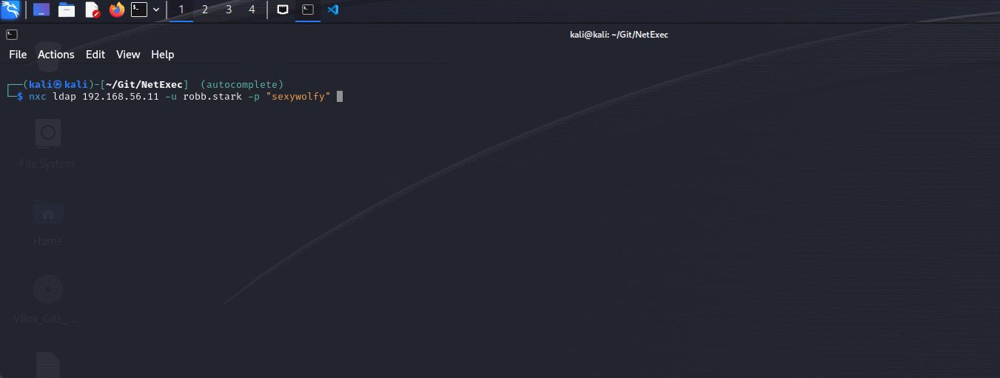
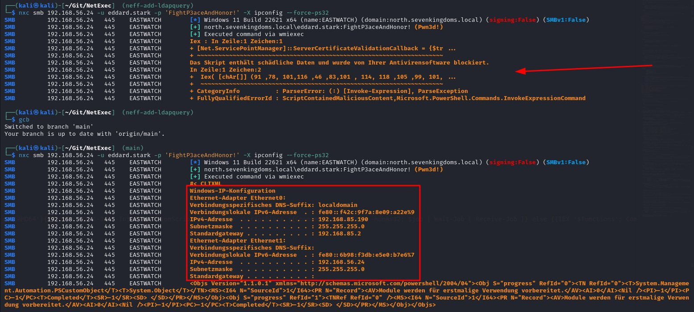

# 📡 v1.2.0 - ItsAlwaysDNS

大家好！

距离上次发布已经有一段时间了。我们现在有了这么多很棒的功能,新版本的发布早就应该到来。但首先,要感谢所有贡献者和在 discord 服务器上提供想法、提交问题和参与讨论的人。让我们深入了解这些令人惊叹的新模块和功能的长列表,从我们的第一个重大公告开始。

<figure><figcaption>
Woop woop
</figcaption></figure>

## NetExec 已在 Kali 上可用:rocket:

最大的新闻是,在 [@arszilla](https://x.com/arszilla) 的巨大帮助下,这个版本也可以在 kali 上使用了。经过大约 3 个月的 Kali 端包更新,一切都已准备就绪。所以现在你可以直接用 apt 安装最新版本:

<figure><figcaption>
使用 apt 安装 NetExec
</figcaption></figure>

## 总是 DNS ...

... 这就是为什么我们现在有了完全集成的 DNS 选项,感谢 [@XiaoliChan](https://x.com/Memory_before)！你可以使用 `--dns-server` 指定 DNS 服务器,或使用 `--dns-tcp` 强制使用 TCP 进行 DNS。这也允许你使用 `-6` 强制使用 IPv6,并使用 `--dns-timeout` 设置 DNS 超时。

## 是时候收集凭证了💰

听说过 SCCM 吗？你现在可以使用新的标志 `--sccm` 导出所有由 DPAPI 存储的 SCCM 凭证。此外还有很多新模块可以获取各种软件存储的凭证,如 MobaXterm、mRemoteNG、一些 vnc 服务器软件和 Google Refresh Tokens,感谢 [@zblurx](https://x.com/_zblurx)！

<figure><figcaption>
Looting SCCM
</figcaption></figure>

<figure><figcaption>
Looting MobaXterm
</figcaption></figure>

<figure><figcaption>
Looting mRemoteNG
</figcaption></figure>

<figure><figcaption>
Looting VNC
</figcaption></figure>

## Looting PuTTY

此外,感谢 [@NeffIsBack](https://x.com/al3x_n3ff) 的贡献,现在也可以获取存储在 PuTTY 中的凭证和 RSA 私钥。

<figure><figcaption>
从 PuTTY 获取 RSA 私钥和代理凭证
</figcaption></figure>

## Extract obsolete operating systems from LDAP

使用新的 LDAP 模块 `-M obsolete`,你可以查询 LDAP 中的过时操作系统！由 [@Shad0wC0ntr0ller](https://x.com/Shad0wCntr0ller) 开发。

## New LDAP flag for retrieving active Users on the Domain

新的 LDAP 标志 `--active-users` 与 `--users` 具有相同的用途,但会过滤掉已停用的账户。由 [@termanix](https://github.com/termanix) 开发。

## New SMB Module Printerbug

现在可以使用 NetExec 利用著名的 Printerbug 强制认证技术,滥用 MS-RPRN！由 [@lodos2005](https://github.com/lodos2005) 开发。



## 使用 SMB 寻找 ADCS

现在有一个新的 SMB 模块,可以枚举 certsrv.exe 的 DCERPC 端点,表明服务器是一个 CA。它还会枚举 CA 是否容易受到 ESC8 的攻击。由 [@0xjbb](https://github.com/0xjbb) 开发。

## 新的 LDAP 模块枚举 userPassword 和 unixUserPassword 属性

有些软件会在 LDAP 属性 `userPassword` 和 `unixUserPassword` 中填充可能的明文凭证。新的 LDAP 模块 `-M get-userPasswsord` 和 `-M get-unixUserPassword` 将查询所有用户的这些属性。由 [@Syzik](https://x.com/SyzikSecu) 开发。

## 新的 Winlogon 自动登录模块

Windows 允许配置在启动时自动登录机器的用户。使用 [@swisskyrepo](https://x.com/pentest_swissky) 开发的新 SMB 模块,你现在可以获取存储在注册表 `HKLM\Software\Microsoft\Windows NT\CurrentVersion\Winlogon` 中用于该登录过程的键值 **DefaultDomainName、DefaultPassword、DefaultUserName、AutoAdminLogon** 的内容。



## 原始 LDAP 查询

现在有一个新的 LDAP 标志 `--query "(Object)" "Filter"`,使用标准的 ldapsearch 语法可以快速查找 LDAP 中的属性。由 [@NeffIsBack](https://x.com/al3x_n3ff) 开发。

## 更新的 LDAP 和 SMB 用户枚举

SMB/LDAP `--users` 和 LDAP `--active-users` 标志现在允许过滤特定用户！感谢 [@Marshall-Hallenbeck](https://x.com/MJHallenbeck)。

 

## 更新的 PSO 模块

[@sebrink](https://x.com/_sandw1ch) 更新了 pso 模块,该模块可以获取域中所有细粒度密码策略,为模块带来了全新的外观,并修复了一个关键 bug - 如果策略附加到多个对象,该策略不会显示。

## 身份验证限流

旧的 `--jitter` 选项已重新设计,以启用身份验证限流。如果你想更加隐蔽或绕过锁定机制,这非常有用。由 [@NeffIsBack](https://x.com/al3x_n3ff) 开发。

## Tab 补全

感谢 [@Adamkadaban](https://x.com/Adamkadaban),如果使用 pipx 安装,NetExec 现在支持 tab 补全！查看安装页面了解设置。

<figure><figcaption>
使用 NetExec 的 Tab 补全
</figcaption></figure>

## PowerShell 命令执行重构

对 NetExec 中的 PowerShell 功能进行了重大改进,修复了大多数 bug 并改进了整体可用性和稳定性。混淆和 Amsi 绕过也被设置为非默认,因为它们经常被杀毒软件标记。一个很好的副作用是 `ps32` 降级现在可以绕过 Windows Defender😄\
由 [@Marshall-Hallenbeck](https://x.com/MJHallenbeck) 开发。

<figure><figcaption>
使用 --force-ps32 绕过 Windows Defender
</figcaption></figure>

## 结语

如果你想详细了解所有更改或下载最新的独立二进制文件,请查看 github 页面:


